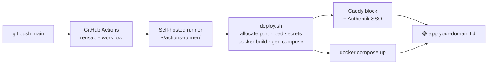
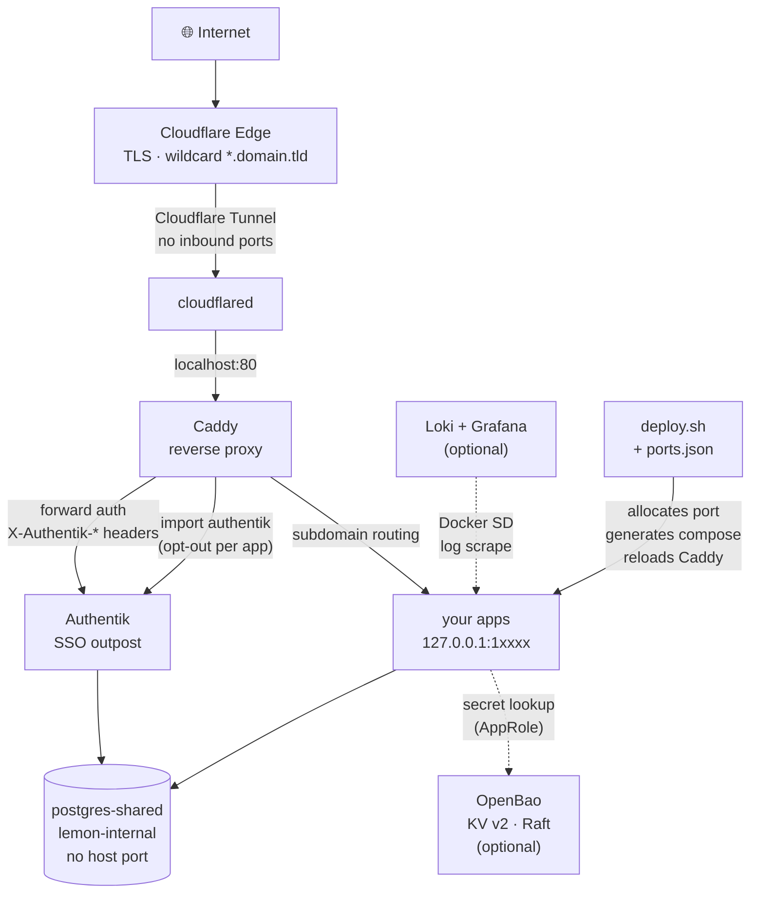

# lemon-stack

> A self-hosted PaaS for your homelab or VPS, **maintained by an LLM agent**. Push to GitHub → auto-deploys with SSO, secrets, logging, and reverse proxy. The agent files Plane tickets, runs daily health checks, and updates its own context as your server evolves.

`lemon-stack` is an opinionated bundle of battle-tested infrastructure:

- **Caddy** reverse proxy + automatic HTTPS via **Cloudflare Tunnel** (no open inbound ports on your network)
- **Authentik** SSO in front of every subdomain by default — apps opt out per service
- **postgres-shared** — one Postgres instance, per-app DBs and roles, provisioned with one command
- **OpenBao** (optional) for centralised secrets with per-app AppRoles
- **Loki + Grafana + Promtail** (optional) — every container's logs auto-shipped and filterable per project
- **Auto-deploy pipeline** — push to your GitHub org, get a live SSO-protected subdomain at `<repo>.your-domain.tld`
- **28 Claude Code skills + 4 agents (including a daily `server-maintainer`)** that teach an agent how to run the whole thing — and keep running it
- **`lemon` CLI** — composite JSON reads of every component's state so an LLM can answer "is app X healthy?" in one call

It is *not* a generic Kubernetes platform. It is what one person actually runs on a single Linux box, with the rough edges sanded off and the personal bits replaced with `{{VARIABLES}}`.

---

## How the agent maintains it

lemon-stack ships with an opinionated agent runtime that runs on the same box as the services it manages. Once you install it, the agent does the following on its own:

- **Daily health pass** — the `server-maintainer` agent runs every morning via `claude-runner` (a host systemd service). It calls `lemon server-health`, runs `scripts/verify-install.sh`, checks drift, scans the backup log, and posts a one-message summary to Discord (or Telegram) via `tg-notify`.
- **Plane audit trail** — every non-trivial change (and the daily pass) opens a ticket in your Plane project, transitions it through *In Progress → Done*, and links the relevant files/commits. You always know what an agent touched, when, and why.
- **Self-updating context** — the agent rewrites `~/.claude/CLAUDE.md` whenever it discovers new state or a non-obvious gotcha, and appends durable findings to a per-host `~/.claude/memory/` scaffold so future sessions don't start cold.
- **Optional Obsidian vault** — if you install the optional `obsidian` component, the agent also appends human-readable daily notes there alongside the Plane audit log.

You can wire it up by adding `claude-runner` (and optionally `obsidian`) to `COMPONENTS` in `setup/parameters.env`. Starter n8n workflows in `infra/n8n/starter-workflows/` schedule the daily session, disk-usage alerts, uptime monitoring, and backup digests.

### What the agent does for you

- Files and resolves a Plane ticket per material change, with diffs and rationale
- Runs `verify-install.sh` daily and surfaces only real regressions
- Reports drift, failing backups, sealed OpenBao, and unhealthy containers proactively
- Keeps `CLAUDE.md` accurate so the next session starts informed, not lost
- Writes human-readable daily notes to your Obsidian vault (optional)

---

## What you get

| Component | Mandatory | What it does |
|---|---|---|
| Caddy | ✅ | Reverse proxy, TLS, per-subdomain routing, forward-auth integration |
| Cloudflare Tunnel | ✅ | Public access without exposing inbound ports |
| Authentik | ✅ | SSO for every subdomain, header-based identity (`X-Authentik-*`) |
| postgres-shared | ✅ | One Postgres instance, per-app DB/role, no host port |
| Deploy pipeline | ✅ | `deploy.sh` + GitHub Actions reusable workflow + self-hosted runner |
| OpenBao | ⬜ | Centralised secrets, AppRoles, KV v2, Raft snapshots |
| Loki / Grafana / Promtail | ⬜ | Centralised logs, Docker SD, 30-day retention |
| Pi-hole + Unbound | ⬜ | DNS ad-blocking on your LAN |
| n8n | ⬜ | Workflow automation, can call any internal app over `lemon-internal` |
| claude-runner | ⬜ | Host systemd service that runs the `server-maintainer` agent on a schedule + handles Plane-driven Claude/Copilot tasks |
| Obsidian | ⬜ | Self-hosted notes vault; the agent writes daily maintenance notes here |
| Backup (restic) | ⬜ | Daily restic backups (any backend), pluggable dump hooks, guided restore |

---

## Deploy flow

Push to your GitHub org — the app is live with SSO in under a minute:



---

## Quickstart

```bash
# 1. Clone
git clone https://github.com/<your-username>/lemon-stack ~/lemon-stack
cd ~/lemon-stack

# 2. Run the guided installer
./setup.sh
#   - prompts for: domain, GitHub org, admin email, timezone, Cloudflare tunnel token,
#     optional: Telegram bot, OpenBao, monitoring, Pi-hole, n8n
#   - renders all {{VAR}} templates
#   - brings up Caddy + Cloudflare Tunnel + Authentik + postgres-shared
#   - optionally brings up the components you ticked
#   - installs the `lemon` CLI
#   - installs Claude Code skills into ~/.claude/skills/
#   - prints the steps to register your GitHub Actions self-hosted runner
#     (registration itself needs a token from your org settings — manual)

# 3. Push your first app
gh repo create <your-org>/<your-app> --template <your-username>/lemon-stack-template-repo
# edit, commit, push — done. App lives at <your-app>.your-domain.tld
```

> **Status:** skills + docs, the infra compose templates, `setup.sh`, the `lemon`
> CLI, the app mirrors, and the drift/leak-guard tooling are all shipped. The
> stack is extracted from (and continuously drift-checked against) one
> production server; the guided installer has not yet had an independent
> clean-machine run — treat `setup.sh` as beta and check
> [docs/troubleshooting.md](./docs/troubleshooting.md) if a step misbehaves.

---

## Requirements

- Linux host (Ubuntu 24.04 LTS reference; any modern distro with systemd should work)
- Docker Engine 24+ and Docker Compose v2 (`docker compose ...` — NOT `docker-compose`)
- A Cloudflare account with the target domain on it (free tier is fine)
- A GitHub org with Actions enabled (your personal account works too)
- ~4 GB RAM minimum (Authentik + Postgres + Caddy = ~1.5 GB at idle; add another 1 GB if you enable monitoring)
- ~10 GB disk for the stack itself, plus whatever your apps need

---

## Architecture



See [`docs/architecture.md`](./docs/architecture.md) for component contracts, network layout, and the SSO header contract.

---

## Components

Compose templates for every component live in `infra/`, bootstrap guides in `docs/` ([Authentik](./docs/authentik-bootstrap.md), [OpenBao](./docs/openbao-bootstrap.md), [pipeline deep-dive](./docs/pipeline-deep-dive.md)). The **Claude Code skills** in `claude/skills/` are the operational reference:

- `claude/skills/auth/` — Authentik SSO, header contract, retrofit recipe
- `claude/skills/deploy/` — Pipeline internals, ports.json, secrets fallback
- `claude/skills/new-project/` — Scaffolding a fresh app, two language paths
- `claude/skills/ship/` — Wiring up an *existing* repo for auto-deploy
- `claude/skills/dashboard/` — Aggregator app contract, `/api/_internal/user-summary`
- `claude/skills/notify/`, `tg-notify/` — Centralised Web Push + Telegram
- `claude/skills/server-status/`, `docker-info/`, `network-info/`, `security-info/` — Inspection commands
- ... full list in `claude/skills/`

---

## Adding your own apps

The deploy pipeline expects a repo with **either** a top-level `Dockerfile` (single-service) **or** a top-level `docker-compose.yml` (multi-service). Authentik SSO is opt-out: add `auth=none` to `deploy.conf` if your app has its own auth.

See [docs/adding-apps.md](./docs/adding-apps.md) for the full walkthrough,
`claude/skills/new-project/SKILL.md` for the scaffolding recipe, and
`claude/skills/ship/SKILL.md` for converting an existing repo.

---

## Claude Code integration

If you use [Claude Code](https://claude.com/claude-code), `setup.sh` installs the bundled skills into `~/.claude/skills/` and writes a starter `~/.claude/CLAUDE.md` from `claude/CLAUDE.md.template`. The skills are written so an agent can answer "where does this app store its secrets?", "why is the runner offline?", or "scaffold me a new React + Hono app" without re-discovering the conventions every session.

You don't need Claude Code to use lemon-stack — the skills are also readable as plain Markdown documentation.

---

## Maintenance

- **Backups:** add `backup` to `COMPONENTS` — daily restic snapshots of `~/docker/`, `~/deploy/`, the Caddyfile, every database in `postgres-shared`, and OpenBao Raft snapshots, to any restic backend (R2/S3, sftp, local disk), with a guided `restore.sh` and a disaster-recovery runbook. See [docs/backup-restore.md](./docs/backup-restore.md).
- **Upgrades:** `cd ~/lemon-stack && git pull` then run the `/drift-check-upstream` skill to reconcile upstream changes with your local customisations (see [docs/upgrading.md](./docs/upgrading.md)).
- **Re-running `setup.sh`:** safe — it's idempotent. Re-run after changing components in `setup/parameters.env`.

---

## Comparison

| | lemon-stack | Coolify | Dokploy | CasaOS / Umbrel |
|---|---|---|---|---|
| Deploy model | `git push` → live SSO subdomain | Web UI deploy | Web UI deploy | Web UI app installer |
| SSO out of the box | ✅ Authentik, every subdomain | ❌ (per-app) | ❌ | ❌ |
| Secrets manager | ✅ OpenBao (optional) | ❌ | partial | ❌ |
| Shared Postgres | ✅ | per-app | per-app | per-app |
| Centralised logs | ✅ Loki/Grafana | ❌ | ❌ | ❌ |
| Agentic LLM integration | ✅ 28 Claude Code skills + daily self-maintaining agent | ❌ | ❌ | ❌ |
| GUI | ❌ (CLI + Claude) | ✅ | ✅ | ✅ |
| Multi-server | ❌ single host | ✅ | ✅ | ❌ |

If you want a click-to-deploy GUI, use Coolify or Dokploy. If you want one server with strong SSO defaults and an agent that already knows how to operate it, use lemon-stack.

---

## Contributing

This repo is a publication mirror of one person's personal server. PRs are welcome, but please:

- Keep changes generic — anything specific to the maintainer's setup belongs in their personal repos, not here.
- Run `scripts/check-templates.sh` before opening a PR. CI runs it too — any hit on personal-data patterns fails the build.
- For new components, follow the existing template convention: `*.template` files with `{{VAR}}` placeholders, documented in `setup/parameters.example.env`.

---

## License

MIT — see [LICENSE](./LICENSE).

## Credits

lemon-stack stands on the shoulders of:

- [Caddy](https://caddyserver.com/) — the reverse proxy
- [Cloudflare Tunnel](https://www.cloudflare.com/products/tunnel/) — public access
- [Authentik](https://goauthentik.io/) — SSO
- [OpenBao](https://openbao.org/) — secrets
- [Postgres](https://www.postgresql.org/) — the database
- [Loki + Grafana + Promtail](https://grafana.com/) — logs
- [n8n](https://n8n.io/), [Pi-hole](https://pi-hole.net/) — optional components
- [Anthropic's Claude Code](https://claude.com/claude-code) — the agent that runs it
