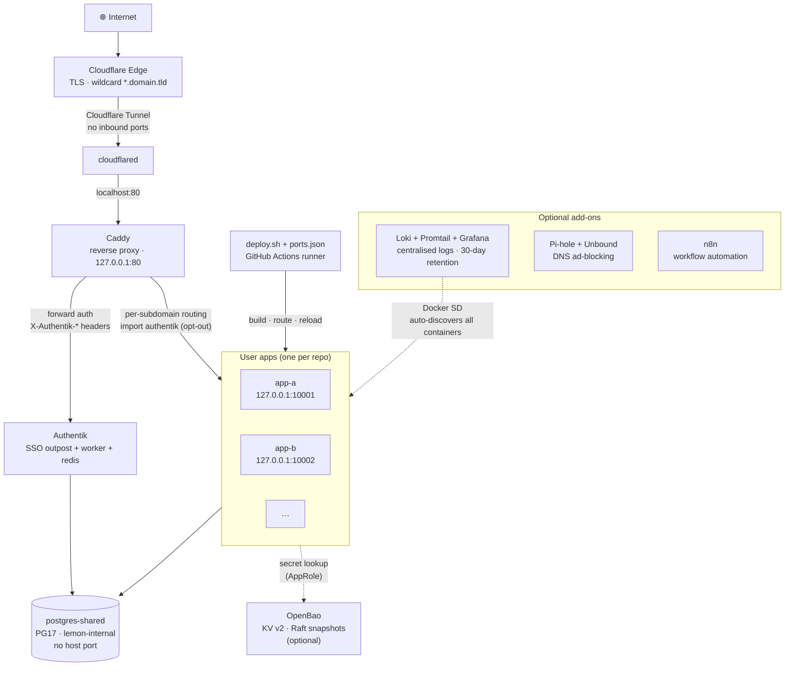
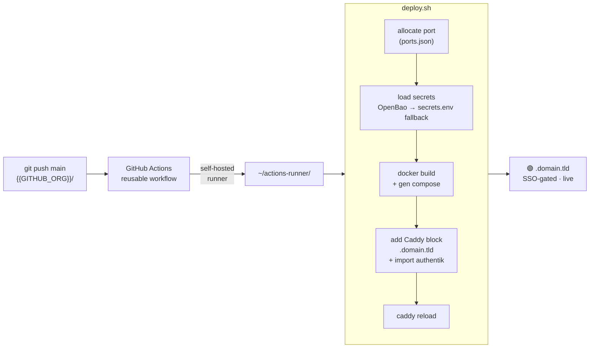

# lemon-stack architecture

## Component diagram

## Deploy flow (single push → live URL)

**Step by step:**

1. Developer pushes to `{{GITHUB_ORG}}/<repo>` `main`.
2. GitHub Actions reusable workflow (in `{{GITHUB_ORG}}/.github`) triggers on the self-hosted runner at `~/actions-runner/`.
3. Runner invokes `~/deploy/deploy.sh <repo>`:
   - Allocates a host port in the 10000–10999 range, recorded in `~/deploy/ports.json`.
   - Loads secrets: tries OpenBao first via `bao-fetch.sh`; falls back to `~/docker/<repo>/secrets.env` (mode 600) if Bao is unreachable or not installed.
   - Builds a Docker image and generates a runtime compose file under `~/docker/<repo>/`.
   - Writes a Caddy block for `<repo>.{{DOMAIN}}` with `import authentik` (SSO-gated by default; repos opt out via `auth=none` in `deploy.conf`).
   - Reloads Caddy.
4. Cloudflare's wildcard `*.{{DOMAIN}}` tunnel route picks up the new subdomain immediately — no DNS entry needed.

## Networks

- **`lemon-internal`** — Docker network shared by infra services and inter-app
  service-to-service calls. Postgres-shared, OpenBao, tg-notify, notify, etc.
  live here. Apps that need to call them attach to this network too.
- **Host network** — used by `cloudflared`, optionally Pi-hole, optionally the
  dashboard API (which needs to reach `127.0.0.1:<port>` on each app).
- **App-local bridge networks** — multi-service apps (e.g. an `api` + `web` pair)
  get their own auto-named compose project network.

## SSO contract

Authentik runs a forward-auth Outpost in front of Caddy. Caddy's
`infra/caddy/snippets/authentik.snippet` (rendered from the template) sends
each request to `outpost.{{DOMAIN}}/outpost.goauthentik.io/auth/caddy` and,
on success, copies these headers into the upstream request:

- `X-Authentik-Username` — Authentik username
- `X-Authentik-Email` — primary email
- `X-Authentik-Groups` — pipe-separated group names
- `X-Authentik-Uid` — stable user UUID (preferred for foreign keys)
- `X-Authentik-Name` — display name

Apps treat these as trusted only because they are stripped from inbound requests
by Caddy before forward-auth runs. Read `/auth` skill for the full retrofit
recipe.

## Secret management

If OpenBao is installed:

- Each app has an AppRole at `auth/approle/role/<app>` and a policy granting
  read on `secret/data/apps/<app>/*`.
- Role + secret IDs live at `~/docker/<app>/.bao-role-id` and `.bao-secret-id`
  (mode 600 — these *are* the credentials Bao trusts on this host).
- `~/deploy/bao-fetch.sh <app>` emits dotenv lines on stdout, used by
  `deploy.sh` to populate the app's runtime environment.
- Bao's own unseal keys + root token live at `~/docker/openbao/init.json`
  (mode 600) — encrypted off-host and **never** committed.

If OpenBao is not installed:

- Each app reads `~/docker/<app>/secrets.env` (mode 600) directly via the same
  fallback path in `deploy.sh`. Simpler, but no rotation history.

## Backup & restore

The optional `backup` component (add `backup` to `COMPONENTS`) installs a
restic-based nightly backup with pluggable dump hooks:

- `~/backup.sh` — generic engine: runs every executable `~/backup.d/*.sh`
  hook (each dumps into a temp `$DUMP_DIR`), then `restic backup`s the path
  list in `~/.config/lemon/backup-paths.txt` plus the dumps, then applies
  retention (7 daily / 4 weekly / 6 monthly, overridable).
- `~/backup.d/` — hooks ship for postgres-shared (globals + every DB), n8n
  (SQLite), and OpenBao (Raft snapshot). Host-only apps add their own hooks
  here without touching the engine.
- `~/.restic-env` (mode 600) — repository + credentials. Any restic backend
  works: S3/R2, sftp, a local disk.
- `~/restore.sh` — guided restore: files/dirs to a staging directory,
  postgres-shared DBs into a scratch `<name>_restoretest` (or `--in-place`
  with typed confirmation), OpenBao snapshot staging.
- Cron: backup daily 03:00, `restic check` monthly. `lemon backup-status`
  and the `daily-backup-digest` n8n workflow report on it.

Full guide + disaster-recovery runbook: [backup-restore.md](./backup-restore.md).
